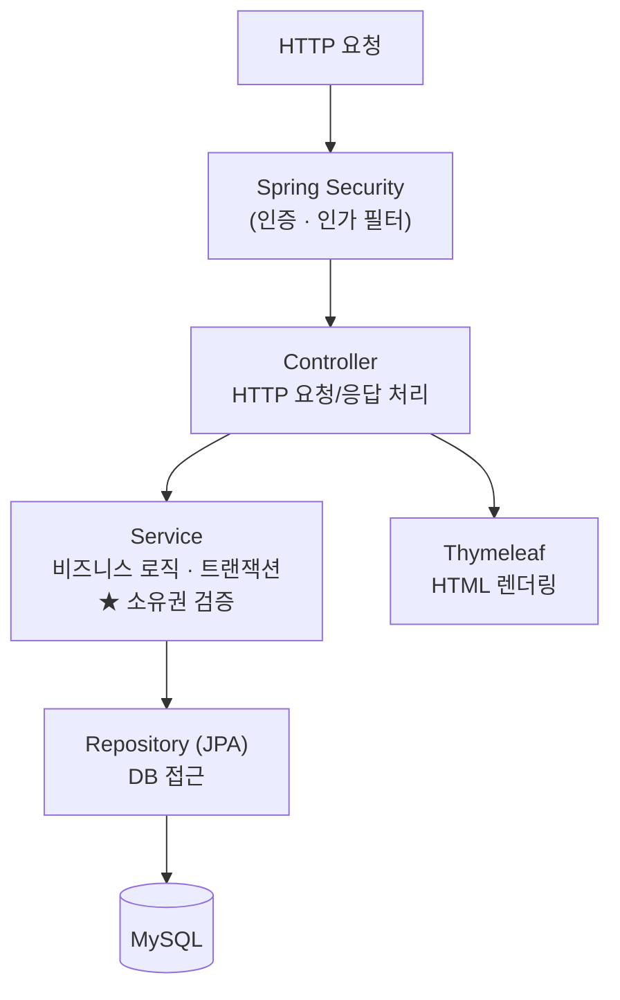
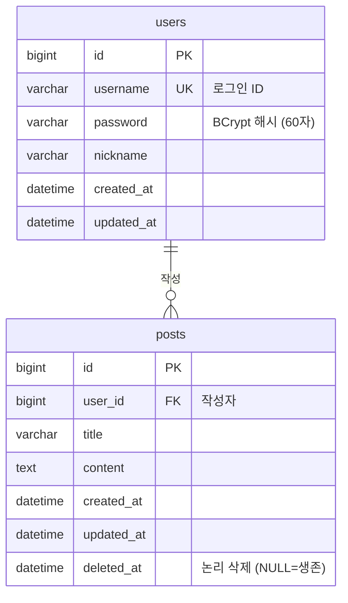

# 미니 게시판 (Mini Board)

계정 기반 게시판을 통해 웹 애플리케이션의 **전체 개발 라이프사이클**(요구사항 분석 → 설계 → 구현 → 예외 처리)을 직접 경험한 학습 프로젝트입니다.

기능 자체는 평범한 게시판이지만, 이 프로젝트의 초점은 **"각 기능을 왜 그렇게 설계했는가"** 에 있습니다.

---

## 📌 프로젝트 개요

| 항목 | 내용 |
|---|---|
| 목표 | 게시판을 소재로 백엔드 개발 라이프사이클을 처음부터 끝까지 완주 |
| 범위 | 게시판 CRUD · 계정 · 권한(본인 글 검증) · 페이징 |
| 특징 | 기능 나열이 아니라 **설계 결정의 근거**에 집중 |

> 이 프로젝트는 "첫 번째 사이클"입니다. 동일한 백엔드 API에 **React 프론트엔드**를 붙이는 두 번째 사이클을 통해 모놀리식 ↔ 프론트/백 분리 아키텍처를 비교 학습할 계획입니다.

---

## 🛠 기술 스택

| 구분 | 기술 |
|---|---|
| Language | Java 21 (LTS) |
| Framework | Spring Boot 4.1 |
| Security | Spring Security (세션 기반 인증) |
| ORM | Spring Data JPA (Hibernate) |
| View | Thymeleaf + Thymeleaf Layout Dialect |
| Client | jQuery (AJAX) |
| Database | MySQL |
| Build | Gradle |

---

## ✨ 주요 기능

- **회원** : 회원가입 / 로그인 / 로그아웃
- **게시판** : 목록 조회(페이징) · 상세 조회 · 작성 · 수정 · 삭제
- **권한** : 로그인 시에만 작성 가능 / **본인 글만 수정·삭제** (서버 검증)
- **예외 처리** : 전역 예외 처리로 사용자에게 친절한 에러 페이지 제공

---

## 🏗 시스템 아키텍처

모놀리식 구조 위에 **계층형 아키텍처**(Controller → Service → Repository → Entity)를 적용했습니다.



**계층을 나눈 이유** — 관심사의 분리(Separation of Concerns). Controller는 HTTP 처리만, Service는 비즈니스 로직과 트랜잭션, Repository는 DB 접근만 담당합니다. 한곳에 모두 몰아넣으면 테스트·재사용·유지보수가 어렵기 때문입니다.

---

## 🗄 데이터베이스 설계 (ERD)



- `users` 1 : N `posts` 관계이며, 외래키(`user_id`)는 N쪽인 `posts`가 가집니다.
- 문자셋은 `utf8mb4`(이모지 대응), PK는 `BIGINT`.
- 작성자 정보를 `posts`에 복제하지 않고 `user_id`로 참조 → **정규화(3NF)** 로 갱신 이상 방지.

---

## 💡 핵심 설계 결정 (Why)

이 프로젝트에서 가장 중요한 부분입니다. 각 결정에는 **선택하지 않은 대안과 그 이유**가 있습니다.

### 1. 본인 글 검증(IDOR 방어)은 서버에서 한다

프론트에서 수정·삭제 버튼을 숨기는 것은 **보안이 아니라 UX**입니다. 버튼이 없어도 URL이나 `curl`로 요청을 직접 보낼 수 있기 때문입니다.

```java
// PostService.java — 소유권 검증
if (!post.isOwnedBy(loginUserId)) {
    throw new AccessDeniedException("본인 글만 수정할 수 있습니다."); // → 403 Forbidden
}
```

이 검증을 **Service 계층**에 둔 이유는, 소유권이 "비즈니스 규칙"이지 "HTTP 처리"가 아니기 때문입니다. Controller에 두면 다른 경로에서 호출할 때 검증이 누락될 수 있습니다.

### 2. 삭제는 논리 삭제(Soft Delete)

물리 삭제는 복구가 불가능하고, 이후 추가될 댓글과의 정합성 문제를 일으킵니다. `deleted_at` 컬럼에 삭제 시각만 기록하고 행은 보존합니다. Hibernate의 `@SQLDelete`(삭제를 UPDATE로 변환)와 `@SQLRestriction`(조회 시 자동 필터)으로 필터링 누락 실수를 방지했습니다.

### 3. 목록 조회 N+1 방지 (fetch join)

목록에서 글 N개의 작성자를 하나씩 조회하면 쿼리가 1+N번 발생합니다. 연관관계는 `LAZY`로 두되(기본 원칙), 작성자가 필요한 목록 조회에서만 `JOIN FETCH`로 한 번에 가져와 쿼리를 1회로 줄였습니다. (EAGER 남발은 지양)

### 4. 비밀번호는 BCrypt 단방향 해싱

복호화가 불가능해 DB 유출 시에도 원문이 보호됩니다. 자동 salt로 같은 비밀번호도 매번 다른 해시가 되고, 의도적으로 느린 연산으로 무차별 대입 공격을 어렵게 만듭니다.

### 5. 엔티티 대신 DTO로 요청을 받는다

폼 데이터를 엔티티에 직접 바인딩하면 의도치 않은 필드까지 주입되는 취약점(Mass Assignment)이 생깁니다. 외부에서 받을 항목만 정의한 DTO를 방패로 사용했습니다.

### 6. 그 외

- **PRG 패턴** : POST 처리 후 리다이렉트로 새로고침 시 중복 등록 방지
- **CSRF 방어** : Spring Security 기본 활성화, AJAX 요청은 헤더에 토큰 첨부
- **전역 예외 처리** : `@ControllerAdvice`로 예외를 한곳에서 처리 (로그는 상세히, 화면은 친절히)

---

## 📁 프로젝트 구조

```
src/main/java/com/example/miniboard
├── config          # 설정 (JPA Auditing, 더미 데이터 등)
├── domain          # 엔티티 (User, Post, BaseTimeEntity)
├── repository      # JPA Repository
├── service         # 비즈니스 로직 · 트랜잭션 · 소유권 검증
├── controller      # HTTP 요청/응답
├── dto             # 요청/응답 데이터 객체
├── exception       # 커스텀 예외 · 전역 예외 처리
└── security        # Spring Security 연동 (UserDetails)
```

---

## 🚀 실행 방법

### 1. 사전 준비
- JDK 21
- MySQL

### 2. 데이터베이스 생성
```sql
CREATE DATABASE miniboard DEFAULT CHARACTER SET utf8mb4;
```

### 3. 설정
`application-dev.yml`(또는 환경변수)에 DB 접속 정보를 입력합니다. 비밀번호 등 민감 정보는 `.gitignore`로 관리합니다.

```yaml
spring:
  datasource:
    url: jdbc:mysql://localhost:3306/miniboard
    username: root
    password: ${DB_PASSWORD}
```

### 4. 실행
```bash
./gradlew bootRun
```
브라우저에서 `http://localhost:8080` 접속.

### 5. 테스트 계정 (더미 데이터)
앱 최초 실행 시 사용자 4명과 예제 게시글이 자동 생성됩니다.

| 아이디 | 비밀번호 |
|---|---|
| usera ~ userd | password123 |

---

## 🔭 향후 계획

- **P2** : 댓글(대댓글) · 검색 · 정렬
- **P3** : 본문 이미지(리치 텍스트) · 관리자 권한(role)
- **2nd Cycle** : 동일 백엔드를 REST API로 전환 후 **React** 프론트엔드 연동

---

## 📝 회고

이 프로젝트의 목표는 "동작하는 게시판"이 아니라 **"각 기능 뒤의 이유를 설명할 수 있는 게시판"** 이었습니다. IDOR·N+1·논리 삭제·PRG 같은 개념을 실제 코드로 부딪히며 익혔고, "기능을 다 넣는 것"보다 "핵심을 완성형으로 끝내는 것(vertical slice)"의 가치를 배웠습니다.